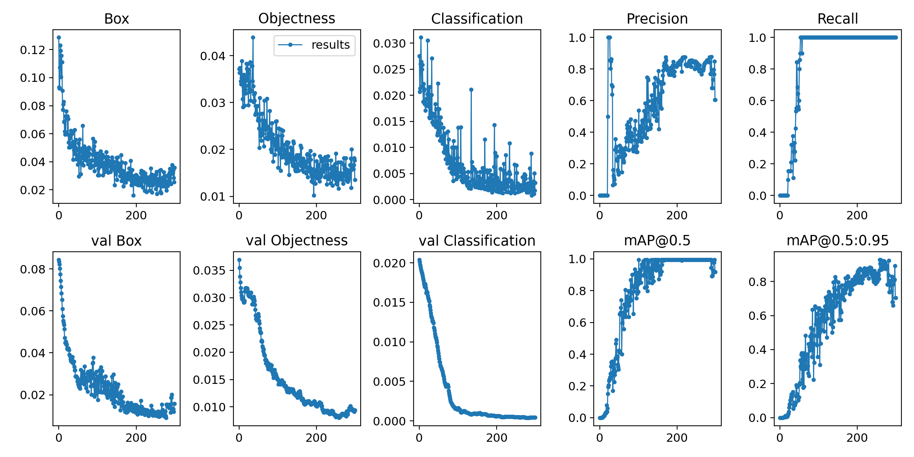
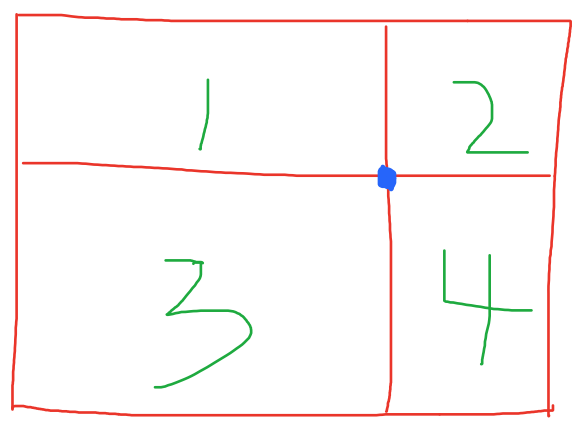
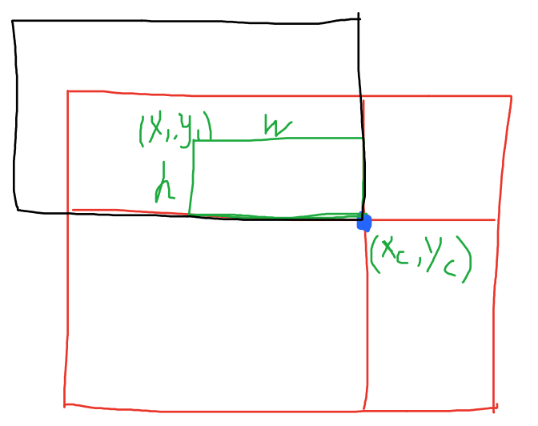
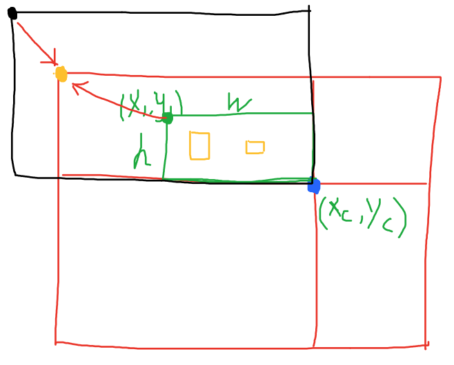
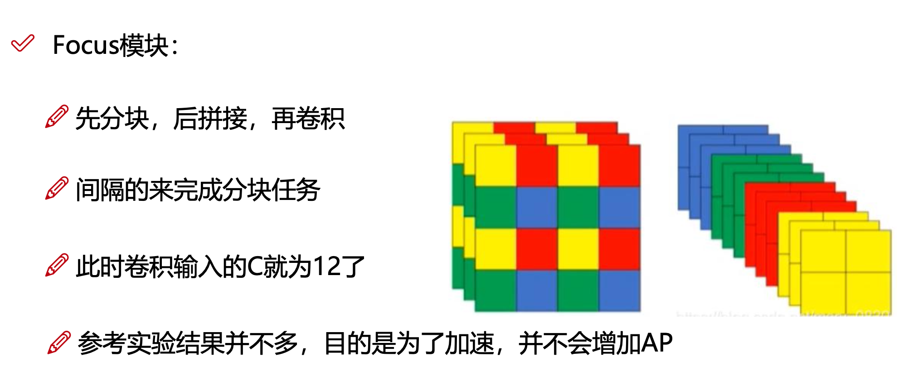
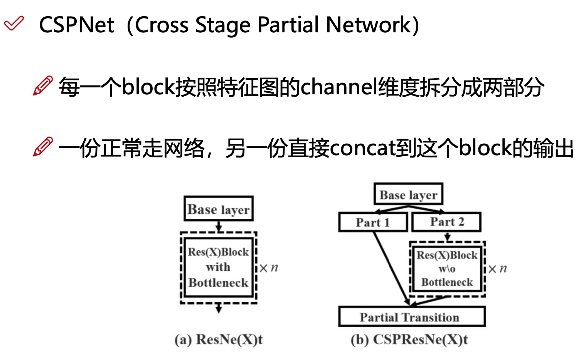
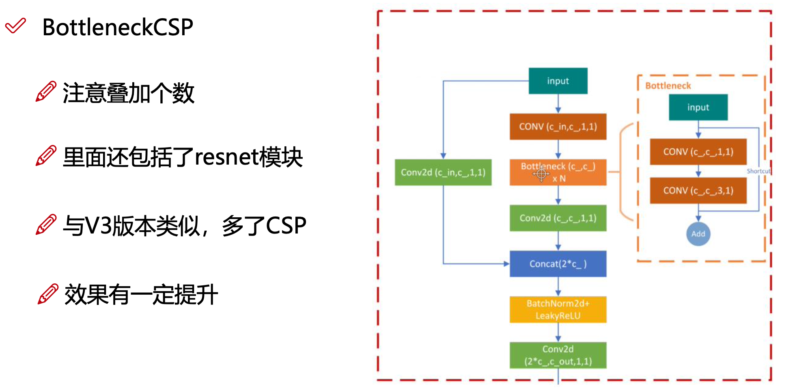
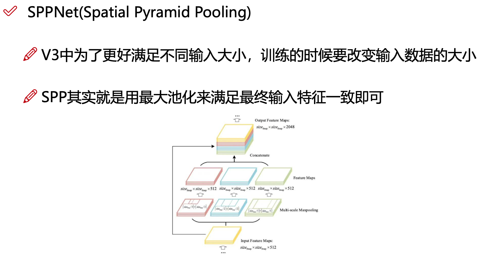

# YOLOV5

YOLOV5实战

###### 此项目是学习完YOLOV5后的一个实战检验，主要是检验是否学会YOLOV5的使用

### 任务目的：

完成对北美蘑菇种类的检测

### 数据集：

此项目的数据集来源于https://public.roboflow.com/  

这里由于设备原因我选择了图片数量较少的数据集

### 任务展示：

这里为随着迭代次数增加各种衡量模型好坏参数的变化图：

可以看出，虽然数据量少，但是效果还是很好的。

下面我们用模型来进行预测，

预测输入图像：

预测结果：

可以看出预测结果还是不错的！

##### 重要操作

##### 一、数据增强——马赛克方法：

1、将四张图像拼接为一张大图，先初始化一张大图幕布（1280*1280，114填充），并且随机找一个中心点，第一张图像由遍历得到，其他三张随机抽取。

2、计算当前图片在拼接后大图中的什么位置。拼接的图像大小可能为黑色框，此时大于1区域，超出界限部分舍弃；拼接的图像大小也有可能为绿色框，此时小于1区域，不足的区域需要进行填充（这里用的是初始化114来进行填充）

3、更新标签坐标框，拼接前标签的坐标框都是相对于原图像的左上角。拼接后需修改为大图的左上角。

注意：数据增强后，如果发生平移或者翻转需要把标签对应的坐标框进行转换。

##### 二、Focus模块

由于一开始拿到的图像size太大，YOLOV5在这里把图像按间隔拆分，然后再拼接，此模块只是单纯的为了方便计算，提升速度，并不会增加模型的AP。

##### 三、BottleneckCSP

这里先回顾一下CSP（Cross Stage Partial Network）。

把输入分成两个部分，一部分正常走网络，另一部分与前面部分得到的结果直接进行拼接得到结果。在特征图维度很高的时候，channel为原来的一半，计算量相比之下小了，保证计算速度更快一些。

CSPNet结构如图：

而，BottleneckCSP则是将输入走两条线，一条线只走了一次卷积，另一条线先走一次卷积然后走一次Bottleneck，其中Bottleneck就是Resent中的shortcut操作，Bottleneck走完后再走两次卷积与另一条线的结果进行拼接，最后经过BatchNormaliztion和ReLU函数，最终结果再经过一次卷积就搞定。

BottleneckCSP结构如图：

Note：shortcut层只是把特征图数值进行相加，而route层是将两特征进行拼接

##### 四、SPP(Spatial Pyramid Pooling)空间金字塔池化层

YOLOV5为了动态的改变输入数据的大小，以满足网络适应不同分辨率的图像，所以用到的了SPP。

SPP有两个作用：

1:增大感受野；

2:最大池化，这使得网络最终输出大小保持一致

SPPNet结构如图：

